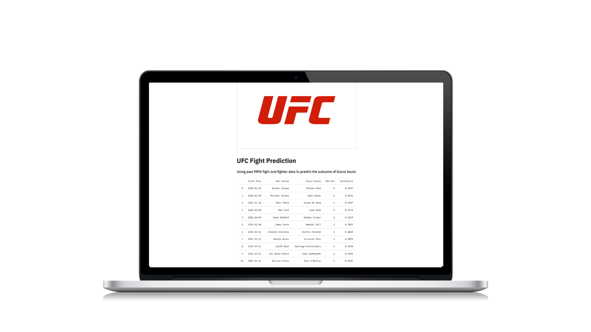
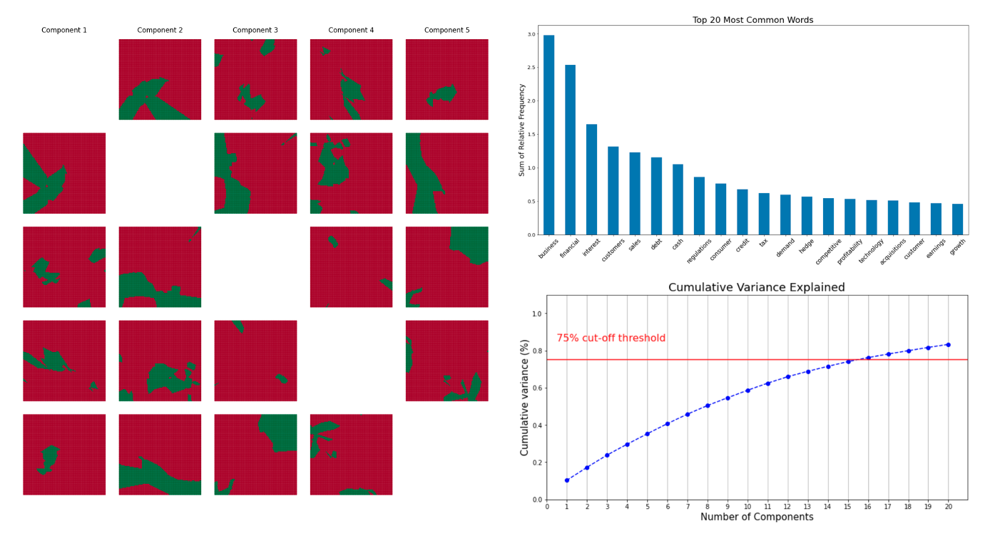
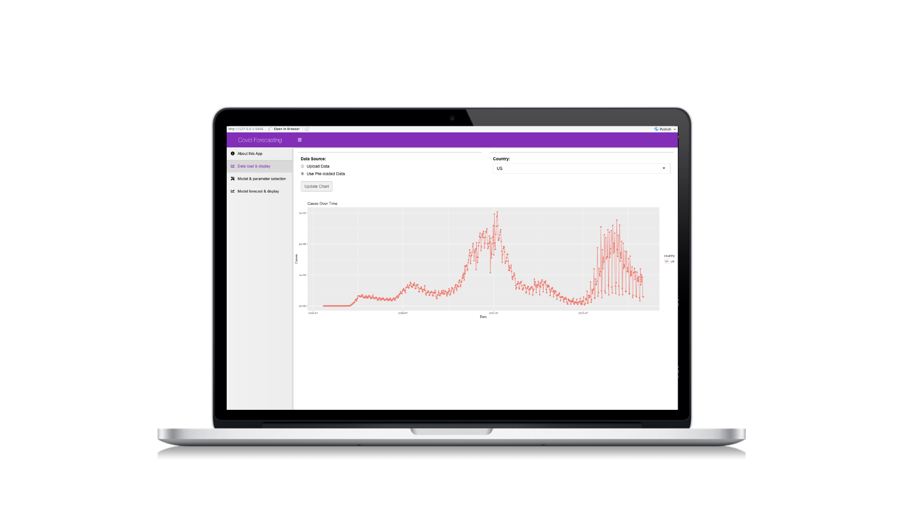

# Portfolio

---
## Featured Projects

### UFC Prediction Web App

I predicted the winner of upcoming UFC fights with an accuracy of 0.66 using a linear SVM classifier. The past MMA event and athlete data was scraped from the official UFC Stats website with BeautifulSoup. To display the predictions, I developed a web application using the Streamlit open‑source framework and deployed via the Heroku cloud platform.

 

 

---
### Firm Strategy and Financial Performance with Natural Language Processing

My team predicted whether a company would outperform the S&P 500 with an accuracy of 0.67 using a k‑nearest neighbors classifier. Historical stock returns were collected using the Alpha Vantage API. For each company, a filtered bag‑of‑words model was created from the forward‑looking text of each company’s SEC annual reporting.

 

 

---
### Accessible Infectious Disease Forecasting

My team created an interactive web app for forecasting COVID-19 cases using Shiny. The raw data is pulled from the Johns Hopkins University Center for Systems Science and Engineering (JHU CCSE) Coronavirus repository. Future case counts are forecasted with a SEIR compartmental model. Users are able to upload their own data in an effort to make COVID-19 forecasting more accessible.

 

 

---

## Other Projects

### Image Compression with K-Means Clustering

### Simple Facial Recognition with Eigenvalues

### Kernel Density Estimation for Psychological Experiments

---

© 2021 Erik Magnusson. Template forked from <a href="https://github.com/evanca/quick-portfolio">evanca</a>

<!-- Remove above link if you don't want to attibute -->
