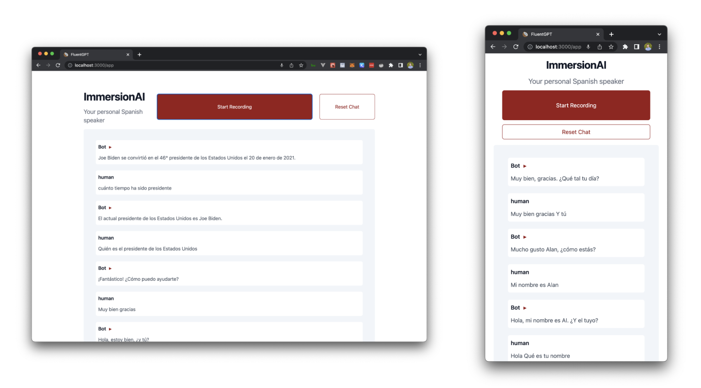
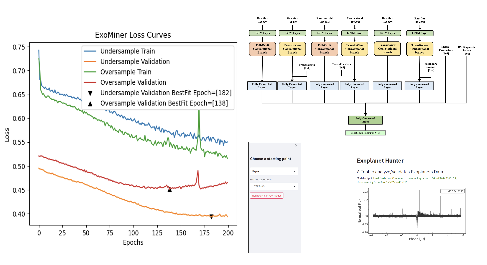
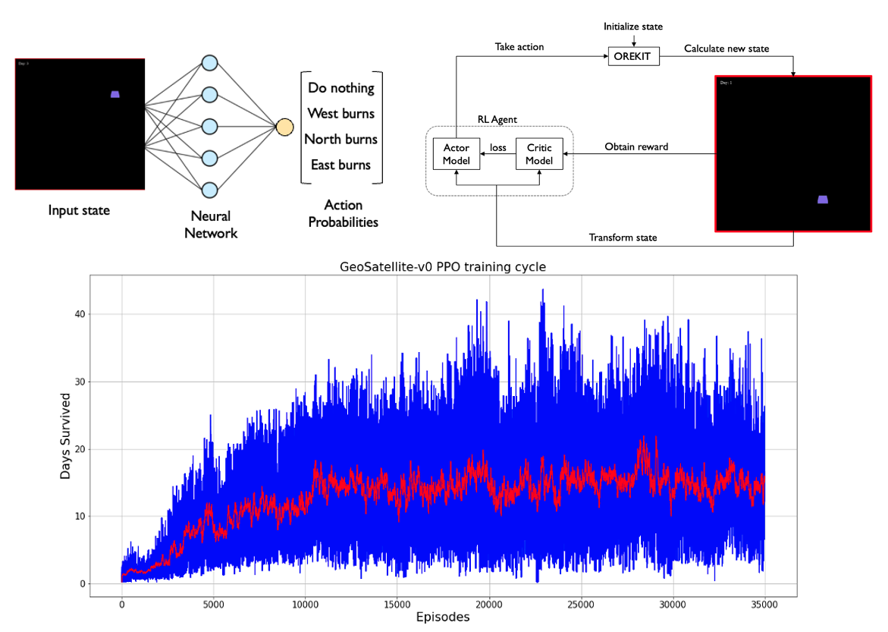

# Portfolio

---
## Featured Projects

### FluentGPT: Language Learning App

[Open Web App](https://fluent-gpt.com/)
<!--  -->

My team and I built and deployed an app that allows users to have spoken conversations in a foreign language to simulate immersion. We leveraged OpenAI and Google APIs for NLP tasks.

 

 

---
### Exoplanet Detection with Deep Learning

<!--  -->

My team automated the detection of planets outside our solar system using time series data from Kepler and TESS NASA missions. We built the full deep learning architecture with PyTorch, eliminating the need for feature engineering used in previous state of the art models. The final model achieved an F1-score of 0.73 when classifying candidate planets, beating the performance of the existing benchmark model (F1-score: 0.70).

 

 

---
### UFC Prediction Web App

I predicted the winner of upcoming UFC fights with an accuracy of 0.66 using a linear SVM classifier. The past MMA event and athlete data was scraped from the official UFC Stats website with BeautifulSoup. To display the predictions, I developed a web application using the Streamlit open‑source framework and deployed via the Heroku cloud platform.

 

 

---
### Firm Strategy and Financial Performance with Natural Language Processing

My team predicted whether a company would outperform the S&P 500 with an accuracy of 0.67 using a k‑nearest neighbors classifier. Historical stock returns were collected using the Alpha Vantage API. For each company, a filtered bag‑of‑words model was created from the forward‑looking text of each company’s SEC annual reporting.

 

 

---
### Accessible Infectious Disease Forecasting

My team created an interactive web app for forecasting COVID-19 cases using Shiny. The raw data is pulled from the Johns Hopkins University Center for Systems Science and Engineering (JHU CCSE) Coronavirus repository. Future case counts are forecasted with a SEIR compartmental model. Users are able to upload their own data in an effort to make COVID-19 forecasting more accessible.

 

 

---
### Deep Reinforcement Learning for Satellite Station-Keeping

My team automated the lifespan‑extending maneuvers of a satellite using deep reinforcement learning with TensorFlow+Keras. We simulated satellite lifespan by designing a custom OpenAI Gym environment to replicate the conditions of geostationary orbit. Pipelines were used to integrate a Java‑based orbit propagator with a Python implementation of the proximal policy optimization algorithm.

 

 

---
## Other Projects

### Image Compression with K-Means Clustering

### Simple Facial Recognition with Eigenvalues

### Kernel Density Estimation for Psychological Experiments

---

© 2023 Erik Magnusson. Template forked from <a href="https://github.com/evanca/quick-portfolio">evanca</a>

<!-- Remove above link if you don't want to attibute -->
